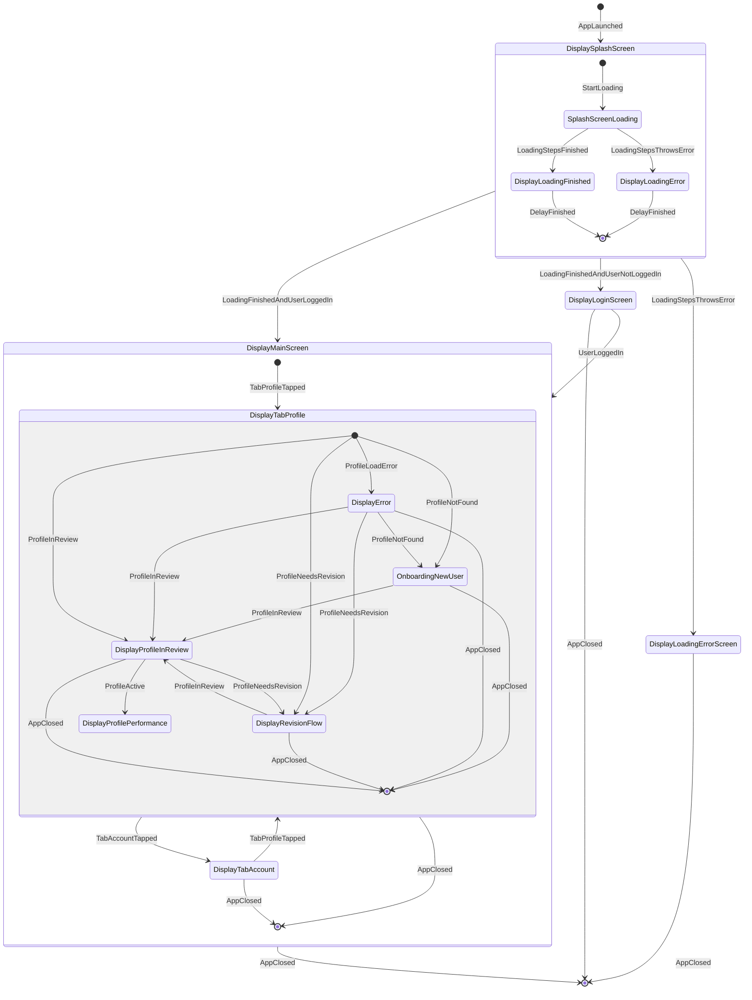

# flutter_solid

A new Flutter project.

## Getting Started

## App State Diagram 

```mermaid

stateDiagram-v2  
  [*] --> DisplaySplashScreen : AppLaunched

DisplaySplashScreen --> DisplayMainScreen : LoadingFinishedAndUserLoggedIn
DisplaySplashScreen --> DisplayLoginScreen : LoadingFinishedAndUserNotLoggedIn
DisplaySplashScreen --> DisplayLoadingErrorScreen: LoadingStepsThrowsError

DisplayMainScreen --> [*] : AppClosed

DisplayLoginScreen --> [*] : AppClosed
DisplayLoginScreen --> DisplayMainScreen : UserLoggedIn

DisplayLoadingErrorScreen --> [*] : AppClosed

state DisplaySplashScreen {
  [*] --> SplashScreenLoading : StartLoading

  SplashScreenLoading --> DisplayLoadingFinished : LoadingStepsFinished
  SplashScreenLoading --> DisplayLoadingError : LoadingStepsThrowsError

  DisplayLoadingFinished --> [*] : DelayFinished
  DisplayLoadingError --> [*] : DelayFinished
}

state DisplayMainScreen {
  [*] --> DisplayTabProfile : TabProfileTapped

  DisplayTabProfile --> DisplayTabAccount : TabAccountTapped
  DisplayTabProfile --> [*] : AppClosed

  DisplayTabAccount --> DisplayTabProfile : TabProfileTapped
  DisplayTabAccount --> [*] : AppClosed

  state DisplayTabProfile {
    [*] --> OnboardingNewUser : ProfileNotFound

    OnboardingNewUser --> DisplayProfileInReview : ProfileInReview
    OnboardingNewUser --> [*] : AppClosed

    [*] --> DisplayError : ProfileLoadError
    DisplayError --> OnboardingNewUser : ProfileNotFound
    DisplayError --> DisplayProfileInReview : ProfileInReview
    DisplayError --> DisplayRevisionFlow : ProfileNeedsRevision
    DisplayError --> [*] : AppClosed

    [*] --> DisplayRevisionFlow : ProfileNeedsRevision
    DisplayRevisionFlow --> DisplayProfileInReview : ProfileInReview
    DisplayRevisionFlow --> [*] : AppClosed

    [*] --> DisplayProfileInReview : ProfileInReview
    DisplayProfileInReview --> DisplayRevisionFlow : ProfileNeedsRevision
    DisplayProfileInReview --> DisplayProfilePerformance : ProfileActive
    DisplayProfileInReview --> [*] : AppClosed


  }

}

```