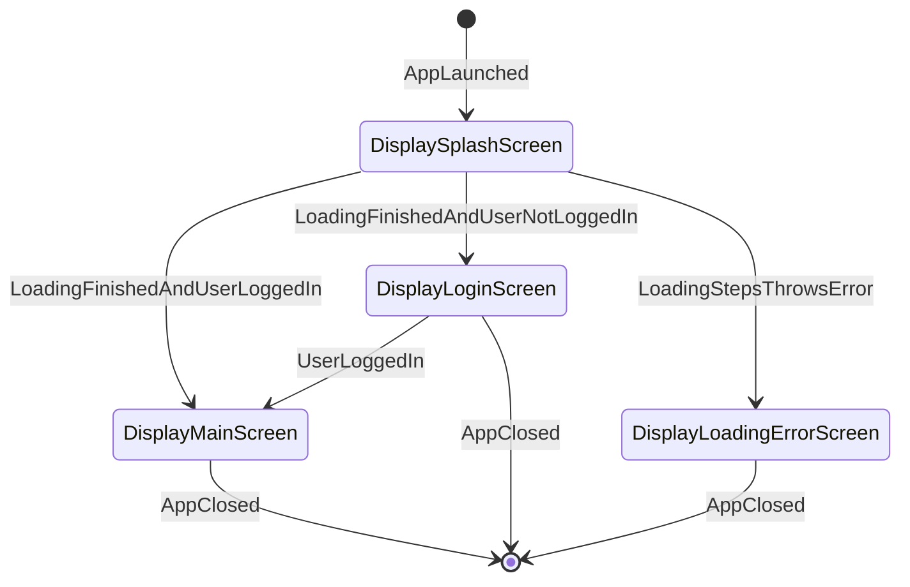
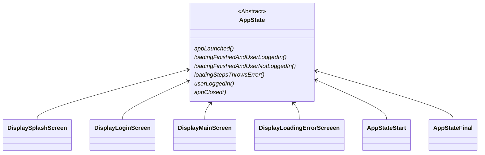

# flutter_solid

A new Flutter project.

## Getting Started

## App State Diagram 

```mermaid

stateDiagram-v2  
  [*] --> DisplaySplashScreen : AppLaunched

DisplaySplashScreen --> DisplayMainScreen : LoadingFinishedAndUserLoggedIn
DisplaySplashScreen --> DisplayLoginScreen : LoadingFinishedAndUserNotLoggedIn
DisplaySplashScreen --> DisplayLoadingErrorScreen: LoadingStepsThrowsError

DisplayMainScreen --> [*] : AppClosed

DisplayLoginScreen --> [*] : AppClosed
DisplayLoginScreen --> DisplayMainScreen : UserLoggedIn

DisplayLoadingErrorScreen --> [*] : AppClosed


```

## The States Class Diagram

```mermaid
classDiagram
  class AppState {
    appLaunched()*
    loadingFinishedAndUserLoggedIn()*
    loadingFinishedAndUserNotLoggedIn()*
    loadingStepsThrowsError()*
    userLoggedIn()*
    appClosed()*
  }

  <<Abstract>>AppState

  class DisplaySplashScreen
  AppState <-- DisplaySplashScreen

  class DisplayLoginScreen
  AppState <-- DisplayLoginScreen

  class DisplayMainScreen
  AppState <-- DisplayMainScreen

  class DisplayLoadingErrorScreeen
  AppState <-- DisplayLoadingErrorScreeen

  class AppStateStart
  AppState <-- AppStateStart

  class AppStateFinal
  AppState <-- AppStateFinal
```
